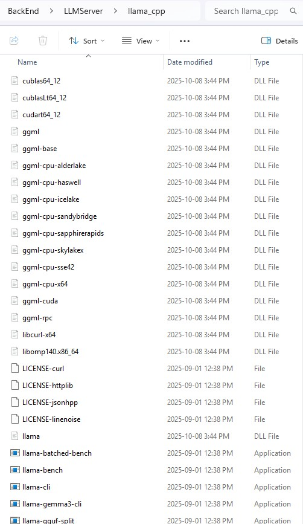

## About the Project
Delta-me13_py is a character chatbot that runs locally using a quantized GGUF LLM and multilingual sentence embeddings. It aims to provide responsive, multilingual dialog while keeping resource usage modest. I started this project after I got inspiration from a game named HSR(Honkai Star Rail). Currently, this code is somewhat messy and runs on hopes and dreams now, but I will work on fixing it.

Because I'm Korean, some part of the code is written in Korean. I will gradually change those into English later.

## Development environment
* OS: Windows 11
* IDE: VScode
* CudaToolKit: 12.9
* CPU: Ryzen 9 7900x
* GPU: RTX 5080
* DRAM: 96 GB DDR5 RAM

## Goal of this project
I have goals for this project, and I need collaborators to achieve them.

**Goals**
* GUI
* Implement the emotion module. (for more humanlike actions)
* Add function calls. (make the character act)
* Add a simulation module to simulate the action of a virtual persona(character) in a series of events.
* Add custom C++ lib
* Most importantly, enhance Python and C++ skills


## Highlights
- Multilingual conversations via `paraphrase-multilingual-mpnet-base-v2`
- Local LLM (GGUF) inference for privacy and speed
- Tried simple fine-tuning with RAG using FAISS-based vector search for fast retrieval over dialogue/context


## Installation

Follow these steps to set up the project environment locally. This guide covers installing necessary system-level dependencies, setting up a Python virtual environment, and downloading the required models.

1.  **Prerequisites**
    Before you begin, ensure you have the following software installed on your system.
    
    * Python 3.11: This code is based on Python 3.11
        * You can download it from the [Python Downloads](https://www.python.org/downloads/)
    * NVIDIA CUDA Toolkit 12.9: Required for GPU acceleration.
        * You can download it from the [NVIDIA CUDA Toolkit Archive.](https://developer.nvidia.com/cuda-12-9-0-download-archive)

    * npm

    * React compiler
          
2.  Setup Steps
    1. Clone the Repository
    ```sh
    git clone https://github.com/namjuu3913/Delta_me13_RE.git
    ```
    
    2. Navigate to the project directory.
    ```sh
    cd Delta_me13_RE
    ```
    
    3. Create a Python Virtual Environment

       I recommend using a virtual environment to isolate project dependencies. The following command will create a folder named .venv in your project directory.
    ```sh
    
    py -3.11 -m venv .venv
    ```
    
    4. Activate the Virtual Environment

        You must activate the environment before installing packages.
       * On Windows (PowerShell/CMD):
         ```sh
            .\.venv\Scripts\Activate
         ```
       * On macOS/Linux (Bash/Zsh):
         ```sh
            source .venv/bin/activate
         ```
        (I'm not sure it will work on macOS and Linux)
    
    5. Install Required Python Packages

        Install all the necessary libraries from the requirements.txt file into your active virtual environment.
         ```sh
            pip install -r requirements.txt
         ```
3. Download llama.cpp
    * #### llama.cpp
        You can download llama.cpp from [llama.cpp/releases](https://github.com/ggml-org/llama.cpp/releases)
        
        Download both cudart-llama-bin-win-cuda-12.4-x64.zip and llama-b6715-bin-win-cuda-12.4-x64.zip

        After download and unzip the folders, put every files in the ```BackEnd\LLMServer\llama_cpp``` folder.

        


 4. Download Models
   * #### LLM (GGUF)
     
     You can download any GGUF-formatted model from [huggingface](https://huggingface.co/) in the ```BackEnd\LLMServer\models``` folder.
     
     Recommended & tested: Qwen3-14B-Q4_K_M, (see the model on [Hugging Face](https://huggingface.co/Qwen))
     
   * #### Sentence transformer model
   
     **Use paraphrase-multilingual-mpnet-base-v2 model.**

     If you download it with sentence transformer, it usually downloaded at ```C:\Users\UserName\.cache\huggingface\hub```

     Put the folder in the ```BackEnd\PythonServer\Character\models``` file.

     It will look like ```BackEnd\PythonServer\Character\models\models--sentence-transformers--paraphrase-multilingual-mpnet-base-v2```

     Model: [Sentence-Transformers page.](https://huggingface.co/sentence-transformers/paraphrase-multilingual-mpnet-base-v2).

**System Requirements**

Desktop
* Small models(1b ~ 8b): 8–12 GB VRAM
* Medium models (14B–20B): 16 GB VRAM or more
* GPU: NVIDIA recommended. Not tested on Intel or AMD (Ryzen) GPUs.
* System RAM (DRAM): 32 GB recommended. Not tested with 16–32 GB. For smoother operation, 48 GB or more is recommended.

Laptop
* CPU/GPU: A recent CPU with built-in AI acceleration *or* a dedicated GPU model.
* Memory: Unified memory or high-bandwidth RAM such as LPDDR5.
* Capacity: 48 GB (preferred) or at least 32 GB.
* Tested configuration:
    * Verified working on an HX 370 system with 64 GB DDR5. (Used Qwen3 -14b and Qwen3 -8b)
    * Verified working on laptop with i5 13th CPU and 16GB ram. (Used Qwen3 -8b) 

Operating System
* Recommended: Windows
* Not tested: macOS, Linux

You are now ready to run the project!


## How to use it

Run main.exe

## License

This project is distributed under the MIT License. See the ```LICENSE``` file for details.


## Acknowledgments & Key Dependencies

* NVIDIA CUDA Toolkit — GPU computing platform and model. Version 12.9 is used here. 

    License: NVIDIA Software License Agreement.

* PyTorch — Deep learning framework for research to production.

    License: BSD-style.

* Hugging Face Transformers — Pretrained models for text/vision/audio.

    License: Apache 2.0.

* Sentence Transformers — State-of-the-art sentence/text/image embeddings.

    License: Apache 2.0.

* Faiss — Efficient similarity search and clustering for dense vectors.

    License: MIT.

* llama.cpp — The platform that actually runs LLM and opens the server.

    License: MIT.

* nlohmann json.hpp - The json.hpp that makes cpp to use json files.

    License: MIT.
